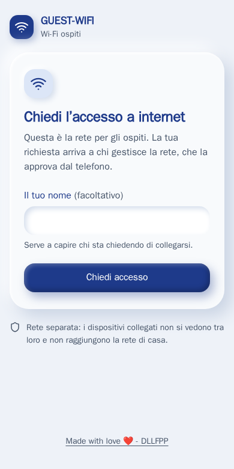
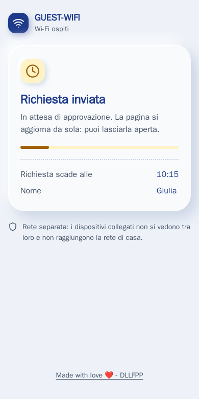
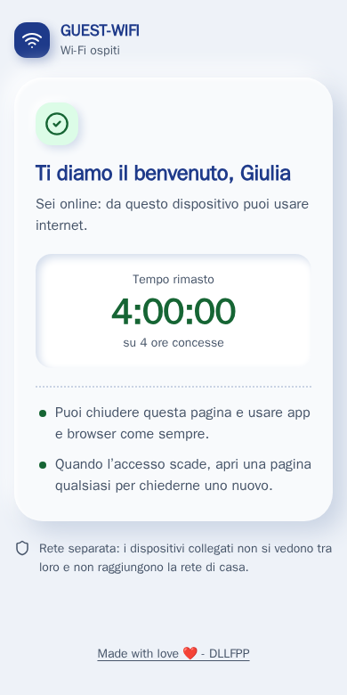
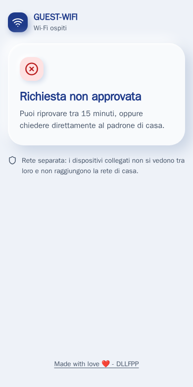

# Omada Guest Approval Portal

An external captive portal for **TP-Link Omada** guest Wi-Fi where every new device has to be
**approved by the owner on Telegram**. The guest asks for access (name optional) and waits; the owner
gets a message with the device details and taps **✅ 4 hours · ✅ 24 hours · ❌ Reject**, and can
**⛔ Revoke** an approved device later.

- Works with Omada EAPs managed by an Omada controller (tested on controller v6.2), no Omada gateway needed.
- Node.js 22, **no dependencies**. One container, state kept in a JSON file on a volume.
- Guest pages are server-rendered HTML with **no JavaScript and no external resources**
  (before approval the guest has no internet): the waiting page refreshes itself, the welcome page shows a
  live **countdown** of the remaining time built in pure CSS.
- The guest pages are in Italian.

## Screenshots

<table>
  <tr>
    <td></td>
    <td></td>
  </tr>
  <tr>
    <td></td>
    <td></td>
  </tr>
</table>

What the owner receives on Telegram (demo data):

```
📶 GUEST-WIFI · richiesta di accesso
👤 Nome: Giulia
📱 Dispositivo: iPhone · Apple · iOS
🔖 MAC 02-00-00-00-00-01 · IP 10.20.30.40
📡 AP: AP-LIVING · 5 GHz
🕒 14:32 · senza risposta scade alle 14:42
[ ✅ 4 ore ] [ ✅ 24 ore ]
[ ❌ Rifiuta ]
```

## How it works

```
guest joins the SSID ─▶ EAP redirects to the controller ─▶ controller redirects to this portal
   /?clientMac=…&apMac=…&ssidName=…&radioId=…&redirectUrl=…
guest taps "Chiedi accesso" ─▶ POST /richiesta ─▶ Telegram message with buttons
owner taps ✅ ─▶ POST /{omadacId}/api/v2/hotspot/extPortal/auth (hotspot operator session)
waiting page reloads ─▶ /benvenuto?id=… (welcome + countdown) ─▶ at zero: "Accesso terminato"
```

- **Authorization** uses the External Portal Server API with a hotspot operator account. On controller
  v6.2.10+ the `time` field is the access **duration in milliseconds** (the controller adds it to the current time).
- **Revoke** uses the same call as the "Unauthorize" button in *Hotspot › Authorized Clients*, so it also
  works for a device that is not connected right now.
- **Device details** (name, vendor, OS, AP, SSID) come from the Omada Open API. A request from a device the
  controller sees on a different SSID is refused.
- The `redirectUrl` that Omada passes is the operating system's connectivity probe
  (`captive.apple.com/hotspot-detect.html`, `msftconnecttest.com/redirect`), not the page the guest wanted,
  so the portal never sends guests there: after approval they land on the portal's own welcome page.
- Rules: a request with no answer expires after 10 minutes, after a rejection the same device waits 15 minutes,
  at most 5 requests can wait at the same time. All configurable.

## Omada setup

All of this can be done in the controller UI or with the Open API.

1. **SSID** for guests, open, with **Guest Network** enabled: clients are isolated from each other and
   cannot reach private networks (RFC 1918), which also keeps them off your LAN.
2. **Hotspot operator** (*Hotspot › Operators*) for the portal. The password needs a special character.
3. **IP-Port groups** for the portal endpoints and an **EAP ACL** (*Network Security › ACL › EAP ACL*)
   that **allows TCP** from the guest SSID to:
   - the controller's portal ports (`8088` and `8843` by default),
   - this service (default port `8097`).

   Without it, Guest Network blocks the portal itself, because both live on private addresses.
4. **Portal** (*Authentication › Portal*): authentication type **External Portal Server**, server = IP and
   port of this service, bound to the guest SSID.
5. **Open API application** in *Client* mode (*Global › Settings › Platform Integration*) for the client
   lookup.

## Telegram

Create a **dedicated bot** with [@BotFather](https://t.me/BotFather) and press *Start* in its chat. The
portal reads the bot with long polling, so nothing else (Home Assistant, n8n, …) may read the same bot:
the buttons would fail with `409 Conflict`.

- **Private chat**: set `TG_CHAT` (and `TG_ADMIN`) to your user id.
- **Group with topics**: add the bot as an admin, set `TG_CHAT` to the group id and `TG_TOPIC` to the topic
  name. The Bot API cannot list topics, so the portal learns the topic id from the first message written in
  it and confirms there; until then requests go privately to `TG_ADMIN`. Or set `TG_THREAD` directly.
- Buttons work for anyone pressing them in the configured chat/topic, and for `TG_ADMIN` everywhere.

## Configuration and deploy

```sh
cp .env.example .env      # fill in controller, operator, SSID and Telegram values
docker compose up -d --build
curl -s http://localhost:8097/salute     # health: requests waiting, Telegram on/off, topic in use
docker logs -f omada-guest-portal        # requests, approvals, button presses
```

The service refuses to start if a required variable is missing. See [`.env.example`](.env.example) for every option.

Preview the welcome page with fake data (no state, no controller calls):
`/anteprima/benvenuto?nome=Giulia&ore=4&secondi=90` (at zero it moves to `/anteprima/terminata`).

## Tests

```sh
node --test test/*.test.js   # full flow and Telegram topics, with a fake controller and a fake Telegram
```

## Notes and limits

- With Guest Network the guests stay on the same subnet as the LAN and take addresses from its DHCP pool.
  If DHCP hands out a DNS server on a private address, guests cannot reach it and fall back to the
  secondary public DNS servers, with a short delay on the first lookups.
- The countdown needs CSS `@property` (iOS 16.4+, Chrome 85+, Firefox 128+); older browsers show the
  starting value without moving.
- Style: "Clay" (claymorphism), one stylesheet with design tokens at the top, `src/stile.css`.
  `design/` holds the generator used to compare design variants.

## License

[MIT](LICENSE)

---

Made with love ❤️ - DLLFPP · [Buy me a coffee](https://buymeacoffee.com/dllfpp)
